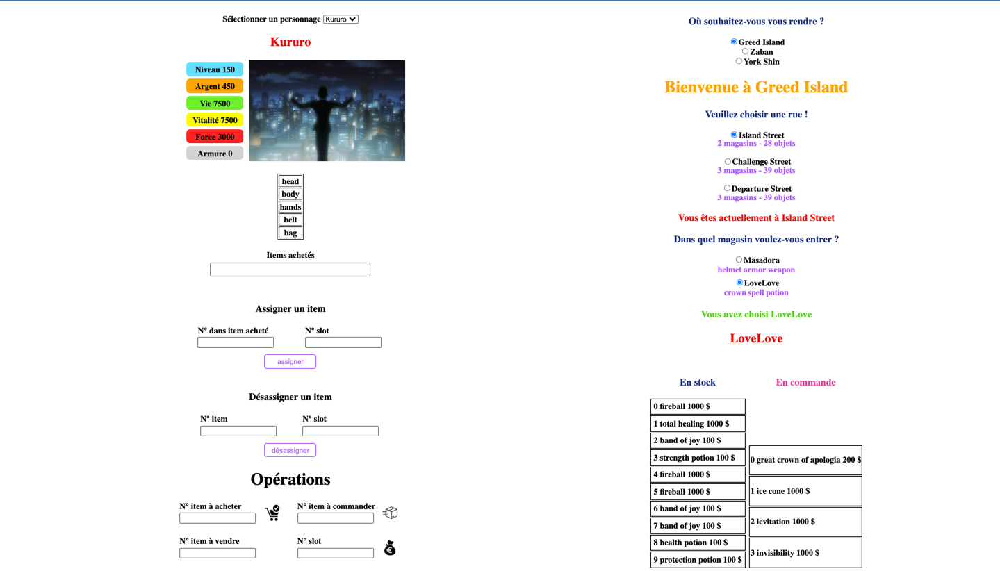

# rpg-vue

## Project setup
```
npm install
```

### Compiles and hot-reloads for development
```
npm run serve
```

### Compiles and minifies for production
```
npm run build
```

### Lints and fixes files
```
npm run lint
```

### Customize configuration
See [Configuration Reference](https://cli.vuejs.org/config/).

# PROJET RPG VueJS

## Project setup
```
Version vue 3 => utilisation de emits
```

#Fonctionnalités
```
Commander / vendre / acheter un article
Equiper / enlever un objet
```


### Image du projet


